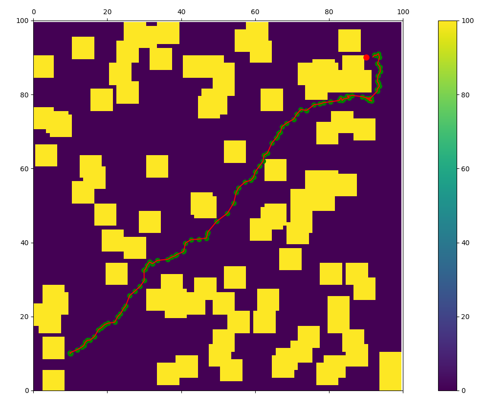

# Model Predictive Path Integral Control
This MPPI implementation,[based on this paper](https://ieeexplore.ieee.org/stamp/stamp.jsp?tp=&arnumber=7487277), is for application to the RoboJackets RoboNav rover.

## How it works
- The algorithm utilizes a monte carlo procedure by producing random noise (gaussian splatter) over a model prediction horizon
- Cost is calculated for each path in the set of paths based on a model of the robot
- The chosen control command is a weighted sum of all the monte carlo paths
- The control command is applied to the robot and the process is repeated
- Note: The annimation may show slight overlap of robot and obstacle without detecting a collision. This is because of the drawing function giving an extra 0.5 width overlap from the actual obstacle border

## File Structure
- `C++`: C++ implementation for application to hardware
- `images`: Result images
- `src`: Python implmentation for logic testing
  - `mppi.py`: Whole MPPI algorithm
  - `annimation.py`: Annimation of the process
  - `obstacle_hit.py`: Function to determine if a continuous agent position hits a discrete obstacle
 
## TODO
- Improve ability to get unstuck from crevaces. It currently cannot understand that short term higher cost of going away from the goal will result in long term low cost since it won't sit stuck forever. If the robot gets stuck, I have tried:
  - Increase prediction horizon: this technically should fix it, but variable prediction horizon will need a mapping calculation reworking becuase the control matrices are currently static
  - Change robot's idea of where the goal is so it goes in a different direction for a short period of time. It is working, but realizes the real goal a bit too soon and just gets stuck again
  - Penalize direction cost so it doesn't care as much about going in the correct direction
  - Penalize obstacle cost so it really wants to get away from the obstacles
- Find solution to x and y flipping in costmap
- Create robot size so it is not just an infintesimal point
- Incorporate actual robot dynamics with non-holonomic drivetrain
- Implement in cpp with ROS

## Output Examples

With gaussian splatter pathing shown

