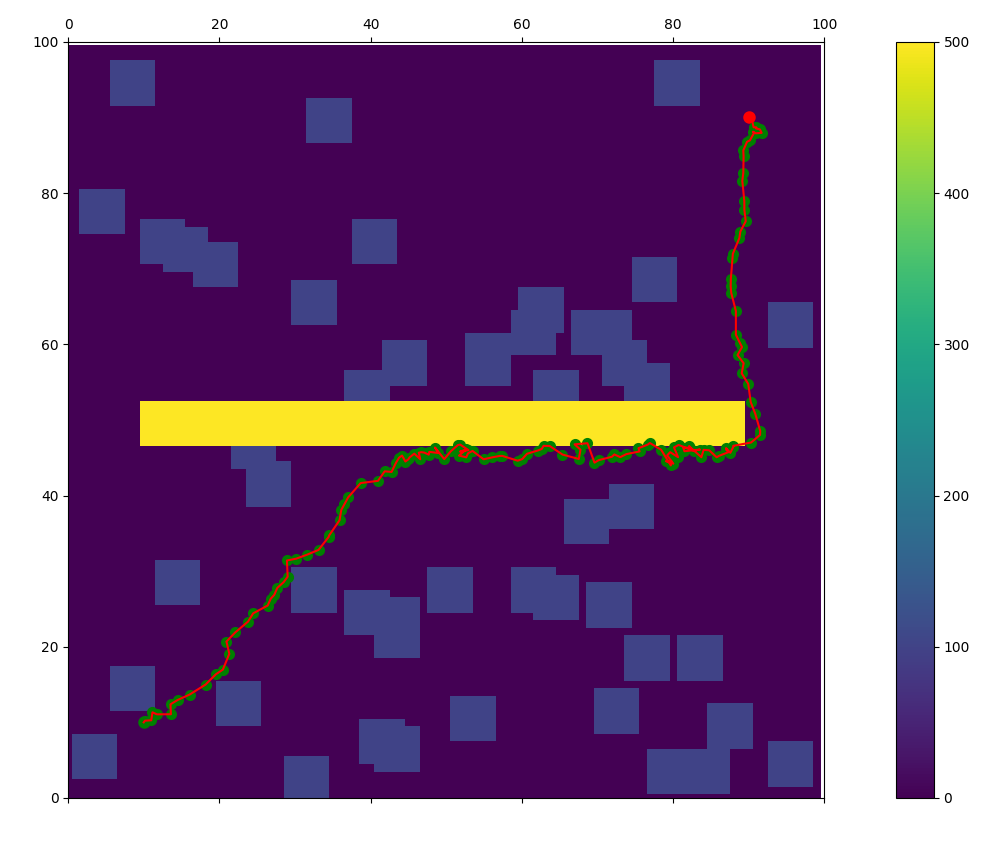

# Model Predictive Path Integral Control
This MPPI implementation,[based on this paper](https://ieeexplore.ieee.org/stamp/stamp.jsp?tp=&arnumber=7487277), is for application to the RoboJackets RoboNav rover.

## How it works
- The algorithm utilizes a monte carlo procedure by producing random noise (gaussian splatter) over a prediction horizon
- Cost is calculated for each path in the set of paths based on a model of the robot
- The chosen control command is a weighted sum of all the monte carlo paths
- The control command is applied to the robot and the process is repeated

## File Structure
- `C++`: C++ implementation for application to hardware
- `src`: Python implmentation for logic testing
  - `mppi.py`: Whole MPPI algorithm
  - `annimation.py`: Annimation of the process
 
## TODO
- Incorporate actual robot dynamics with non-holonomic drivetrain
- Implement in cpp with ROS

## Output Examples

With gaussian splatter pathing shown

